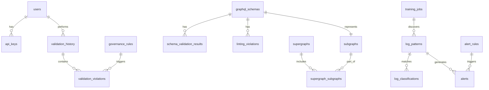

# Database Schema Design

## Overview
This document outlines the database schemas for PostgreSQL (relational data) and Vector DB (embeddings).

## PostgreSQL Schema

### 1. API Governance Tables

```sql
-- API Governance Rules
CREATE TABLE governance_rules (
    id UUID PRIMARY KEY DEFAULT gen_random_uuid(),
    rule_id VARCHAR(50) UNIQUE NOT NULL,
    category VARCHAR(50) NOT NULL,
    subcategory VARCHAR(50),
    severity VARCHAR(20) NOT NULL CHECK (severity IN ('low', 'medium', 'high', 'critical')),
    title VARCHAR(255) NOT NULL,
    description TEXT NOT NULL,
    examples_good JSONB,
    examples_bad JSONB,
    correction_pattern TEXT,
    auto_correctable BOOLEAN DEFAULT false,
    version VARCHAR(20) NOT NULL,
    active BOOLEAN DEFAULT true,
    created_at TIMESTAMP DEFAULT CURRENT_TIMESTAMP,
    updated_at TIMESTAMP DEFAULT CURRENT_TIMESTAMP,
    created_by VARCHAR(100),
    
    INDEX idx_category (category),
    INDEX idx_severity (severity),
    INDEX idx_active (active)
);

-- API Spec Validation History
CREATE TABLE validation_history (
    id UUID PRIMARY KEY DEFAULT gen_random_uuid(),
    validation_id VARCHAR(100) UNIQUE NOT NULL,
    spec_format VARCHAR(50) NOT NULL,
    spec_hash VARCHAR(64) NOT NULL,
    total_rules_checked INTEGER NOT NULL,
    violations_count INTEGER NOT NULL,
    compliance_score DECIMAL(5,2),
    status VARCHAR(20) NOT NULL,
    validated_at TIMESTAMP DEFAULT CURRENT_TIMESTAMP,
    user_id VARCHAR(100),
    organization_id VARCHAR(100),
    
    INDEX idx_validated_at (validated_at),
    INDEX idx_user_id (user_id),
    INDEX idx_compliance_score (compliance_score)
);

-- Validation Violations
CREATE TABLE validation_violations (
    id UUID PRIMARY KEY DEFAULT gen_random_uuid(),
    validation_id UUID REFERENCES validation_history(id) ON DELETE CASCADE,
    rule_id VARCHAR(50) REFERENCES governance_rules(rule_id),
    location TEXT NOT NULL,
    current_value TEXT,
    expected_value TEXT,
    auto_correctable BOOLEAN DEFAULT false,
    correction_applied BOOLEAN DEFAULT false,
    created_at TIMESTAMP DEFAULT CURRENT_TIMESTAMP,
    
    INDEX idx_validation_id (validation_id),
    INDEX idx_rule_id (rule_id)
);
```

### 2. GraphQL Validator Tables

```sql
-- GraphQL Schemas
CREATE TABLE graphql_schemas (
    id UUID PRIMARY KEY DEFAULT gen_random_uuid(),
    schema_id VARCHAR(100) UNIQUE NOT NULL,
    name VARCHAR(255) NOT NULL,
    schema_sdl TEXT NOT NULL,
    schema_hash VARCHAR(64) NOT NULL,
    type VARCHAR(50) NOT NULL CHECK (type IN ('subgraph', 'supergraph')),
    version VARCHAR(50) NOT NULL,
    is_valid BOOLEAN DEFAULT false,
    quality_score DECIMAL(5,2),
    created_at TIMESTAMP DEFAULT CURRENT_TIMESTAMP,
    updated_at TIMESTAMP DEFAULT CURRENT_TIMESTAMP,
    created_by VARCHAR(100),
    
    INDEX idx_type (type),
    INDEX idx_created_at (created_at),
    INDEX idx_schema_hash (schema_hash)
);

-- Subgraphs
CREATE TABLE subgraphs (
    id UUID PRIMARY KEY DEFAULT gen_random_uuid(),
    name VARCHAR(255) UNIQUE NOT NULL,
    url VARCHAR(500) NOT NULL,
    schema_id UUID REFERENCES graphql_schemas(id) ON DELETE CASCADE,
    status VARCHAR(50) NOT NULL DEFAULT 'active',
    last_updated TIMESTAMP DEFAULT CURRENT_TIMESTAMP,
    metadata JSONB,
    
    INDEX idx_status (status),
    INDEX idx_name (name)
);

-- Supergraphs
CREATE TABLE supergraphs (
    id UUID PRIMARY KEY DEFAULT gen_random_uuid(),
    supergraph_id VARCHAR(100) UNIQUE NOT NULL,
    schema_id UUID REFERENCES graphql_schemas(id) ON DELETE CASCADE,
    documentation_url TEXT,
    composition_errors JSONB,
    created_at TIMESTAMP DEFAULT CURRENT_TIMESTAMP,
    
    INDEX idx_created_at (created_at)
);

-- Supergraph Subgraphs (many-to-many)
CREATE TABLE supergraph_subgraphs (
    supergraph_id UUID REFERENCES supergraphs(id) ON DELETE CASCADE,
    subgraph_id UUID REFERENCES subgraphs(id) ON DELETE CASCADE,
    PRIMARY KEY (supergraph_id, subgraph_id)
);

-- Schema Validation Results
CREATE TABLE schema_validation_results (
    id UUID PRIMARY KEY DEFAULT gen_random_uuid(),
    schema_id UUID REFERENCES graphql_schemas(id) ON DELETE CASCADE,
    is_valid BOOLEAN NOT NULL,
    errors JSONB,
    warnings JSONB,
    quality_score DECIMAL(5,2),
    validated_at TIMESTAMP DEFAULT CURRENT_TIMESTAMP,
    
    INDEX idx_schema_id (schema_id),
    INDEX idx_validated_at (validated_at)
);

-- Linting Violations
CREATE TABLE linting_violations (
    id UUID PRIMARY KEY DEFAULT gen_random_uuid(),
    schema_id UUID REFERENCES graphql_schemas(id) ON DELETE CASCADE,
    rule_name VARCHAR(100) NOT NULL,
    severity VARCHAR(20) NOT NULL,
    location TEXT,
    message TEXT NOT NULL,
    auto_fixable BOOLEAN DEFAULT false,
    created_at TIMESTAMP DEFAULT CURRENT_TIMESTAMP,
    
    INDEX idx_schema_id (schema_id),
    INDEX idx_severity (severity)
);
```

### 3. Log Classification Tables

```sql
-- Log Patterns
CREATE TABLE log_patterns (
    id UUID PRIMARY KEY DEFAULT gen_random_uuid(),
    pattern_id VARCHAR(100) UNIQUE NOT NULL,
    template TEXT NOT NULL,
    regex TEXT NOT NULL,
    classification VARCHAR(255) NOT NULL,
    category VARCHAR(100) NOT NULL,
    severity VARCHAR(20) NOT NULL CHECK (severity IN ('DEBUG', 'INFO', 'WARNING', 'ERROR', 'CRITICAL')),
    service VARCHAR(100) NOT NULL,
    environment VARCHAR(50) NOT NULL,
    first_seen TIMESTAMP NOT NULL,
    last_seen TIMESTAMP NOT NULL,
    occurrence_count INTEGER DEFAULT 1,
    root_cause TEXT,
    recommended_action TEXT,
    tags JSONB,
    active BOOLEAN DEFAULT true,
    created_at TIMESTAMP DEFAULT CURRENT_TIMESTAMP,
    updated_at TIMESTAMP DEFAULT CURRENT_TIMESTAMP,
    
    INDEX idx_service (service),
    INDEX idx_severity (severity),
    INDEX idx_category (category),
    INDEX idx_environment (environment),
    INDEX idx_last_seen (last_seen)
);

-- Log Classifications
CREATE TABLE log_classifications (
    id UUID PRIMARY KEY DEFAULT gen_random_uuid(),
    classification_id VARCHAR(100) UNIQUE NOT NULL,
    log_id VARCHAR(255) NOT NULL,
    timestamp TIMESTAMP NOT NULL,
    pattern_id VARCHAR(100) REFERENCES log_patterns(pattern_id),
    similarity_score DECIMAL(5,4),
    classification VARCHAR(255) NOT NULL,
    category VARCHAR(100) NOT NULL,
    severity VARCHAR(20) NOT NULL,
    service VARCHAR(100) NOT NULL,
    environment VARCHAR(50) NOT NULL,
    root_cause TEXT,
    recommended_action TEXT,
    alert_required BOOLEAN DEFAULT false,
    confidence DECIMAL(5,4) NOT NULL,
    processing_time_ms INTEGER,
    used_llm BOOLEAN DEFAULT false,
    created_at TIMESTAMP DEFAULT CURRENT_TIMESTAMP,
    
    INDEX idx_log_id (log_id),
    INDEX idx_timestamp (timestamp),
    INDEX idx_severity (severity),
    INDEX idx_service (service),
    INDEX idx_alert_required (alert_required)
);

-- Alert Rules
CREATE TABLE alert_rules (
    id UUID PRIMARY KEY DEFAULT gen_random_uuid(),
    rule_id VARCHAR(100) UNIQUE NOT NULL,
    name VARCHAR(255) NOT NULL,
    description TEXT,
    severity_levels JSONB NOT NULL,
    services JSONB,
    categories JSONB,
    threshold INTEGER,
    time_window_minutes INTEGER,
    notification_channels JSONB NOT NULL,
    enabled BOOLEAN DEFAULT true,
    created_at TIMESTAMP DEFAULT CURRENT_TIMESTAMP,
    updated_at TIMESTAMP DEFAULT CURRENT_TIMESTAMP,
    created_by VARCHAR(100),
    
    INDEX idx_enabled (enabled),
    INDEX idx_severity_levels ((severity_levels::text))
);

-- Alerts
CREATE TABLE alerts (
    id UUID PRIMARY KEY DEFAULT gen_random_uuid(),
    alert_id VARCHAR(100) UNIQUE NOT NULL,
    rule_id VARCHAR(100) REFERENCES alert_rules(rule_id),
    pattern_id VARCHAR(100) REFERENCES log_patterns(pattern_id),
    severity VARCHAR(20) NOT NULL,
    title VARCHAR(255) NOT NULL,
    description TEXT NOT NULL,
    service VARCHAR(100) NOT NULL,
    environment VARCHAR(50) NOT NULL,
    occurrence_count INTEGER DEFAULT 1,
    first_occurrence TIMESTAMP NOT NULL,
    last_occurrence TIMESTAMP NOT NULL,
    status VARCHAR(50) NOT NULL DEFAULT 'active',
    acknowledged_by VARCHAR(100),
    acknowledged_at TIMESTAMP,
    resolved_at TIMESTAMP,
    metadata JSONB,
    created_at TIMESTAMP DEFAULT CURRENT_TIMESTAMP,
    
    INDEX idx_status (status),
    INDEX idx_severity (severity),
    INDEX idx_service (service),
    INDEX idx_created_at (created_at)
);

-- Training Jobs
CREATE TABLE training_jobs (
    id UUID PRIMARY KEY DEFAULT gen_random_uuid(),
    job_id VARCHAR(100) UNIQUE NOT NULL,
    start_date TIMESTAMP NOT NULL,
    end_date TIMESTAMP NOT NULL,
    status VARCHAR(50) NOT NULL DEFAULT 'pending',
    logs_processed INTEGER DEFAULT 0,
    patterns_discovered INTEGER DEFAULT 0,
    patterns_updated INTEGER DEFAULT 0,
    started_at TIMESTAMP,
    completed_at TIMESTAMP,
    error_message TEXT,
    config JSONB,
    
    INDEX idx_status (status),
    INDEX idx_started_at (started_at)
);
```

### 4. Common Tables

```sql
-- Users
CREATE TABLE users (
    id UUID PRIMARY KEY DEFAULT gen_random_uuid(),
    user_id VARCHAR(100) UNIQUE NOT NULL,
    email VARCHAR(255) UNIQUE NOT NULL,
    name VARCHAR(255) NOT NULL,
    role VARCHAR(50) NOT NULL DEFAULT 'user',
    organization_id VARCHAR(100),
    active BOOLEAN DEFAULT true,
    created_at TIMESTAMP DEFAULT CURRENT_TIMESTAMP,
    updated_at TIMESTAMP DEFAULT CURRENT_TIMESTAMP,
    last_login TIMESTAMP,
    
    INDEX idx_email (email),
    INDEX idx_organization_id (organization_id),
    INDEX idx_active (active)
);

-- API Keys
CREATE TABLE api_keys (
    id UUID PRIMARY KEY DEFAULT gen_random_uuid(),
    key_id VARCHAR(100) UNIQUE NOT NULL,
    user_id UUID REFERENCES users(id) ON DELETE CASCADE,
    key_hash VARCHAR(255) NOT NULL,
    name VARCHAR(255) NOT NULL,
    scopes JSONB NOT NULL,
    expires_at TIMESTAMP,
    last_used TIMESTAMP,
    active BOOLEAN DEFAULT true,
    created_at TIMESTAMP DEFAULT CURRENT_TIMESTAMP,
    
    INDEX idx_user_id (user_id),
    INDEX idx_key_hash (key_hash),
    INDEX idx_active (active)
);

-- Audit Logs
CREATE TABLE audit_logs (
    id UUID PRIMARY KEY DEFAULT gen_random_uuid(),
    user_id VARCHAR(100),
    action VARCHAR(100) NOT NULL,
    resource_type VARCHAR(100) NOT NULL,
    resource_id VARCHAR(255),
    details JSONB,
    ip_address INET,
    user_agent TEXT,
    created_at TIMESTAMP DEFAULT CURRENT_TIMESTAMP,
    
    INDEX idx_user_id (user_id),
    INDEX idx_action (action),
    INDEX idx_resource_type (resource_type),
    INDEX idx_created_at (created_at)
);
```

## Vector Database Schema

### Pinecone / Weaviate Collections

#### 1. API Governance Rules Collection
```json
{
  "index_name": "api-governance-rules",
  "dimension": 3072,
  "metric": "cosine",
  "metadata_config": {
    "indexed": [
      "rule_id",
      "category",
      "subcategory", 
      "severity",
      "auto_correctable",
      "version"
    ]
  }
}
```

**Document Example**:
```json
{
  "id": "rule-001",
  "values": [0.123, -0.456, ...],  // 3072 dimensions
  "metadata": {
    "rule_id": "API-GOV-001",
    "category": "naming_convention",
    "subcategory": "endpoint_naming",
    "severity": "high",
    "title": "Endpoint Naming Convention",
    "description": "All API endpoints must use kebab-case",
    "examples_good": ["GET /user-profile", "POST /order-items"],
    "examples_bad": ["GET /userProfile", "POST /orderItems"],
    "correction_pattern": "Convert camelCase to kebab-case",
    "auto_correctable": true,
    "version": "1.0"
  }
}
```

#### 2. GraphQL Schemas Collection
```json
{
  "index_name": "graphql-schemas",
  "dimension": 3072,
  "metric": "cosine",
  "metadata_config": {
    "indexed": [
      "type",
      "category",
      "federation_entity",
      "subgraph"
    ]
  }
}
```

**Document Example**:
```json
{
  "id": "type-user-001",
  "values": [0.123, -0.456, ...],
  "metadata": {
    "type": "graphql_type",
    "name": "User",
    "category": "entity",
    "fields": ["id", "name", "email"],
    "description": "Represents a user in the system",
    "best_practices": ["Use Connection pattern", "Add pagination"],
    "federation_entity": true,
    "key_fields": ["id"],
    "subgraph": "users-service"
  }
}
```

#### 3. GraphQL Patterns Collection
```json
{
  "index_name": "graphql-patterns",
  "dimension": 3072,
  "metric": "cosine",
  "metadata_config": {
    "indexed": [
      "pattern_name",
      "category"
    ]
  }
}
```

#### 4. Log Patterns Collection
```json
{
  "index_name": "log-patterns",
  "dimension": 3072,
  "metric": "cosine",
  "metadata_config": {
    "indexed": [
      "pattern_id",
      "severity",
      "service",
      "category",
      "environment"
    ]
  }
}
```

**Document Example**:
```json
{
  "id": "pattern-db-timeout-001",
  "values": [0.123, -0.456, ...],
  "metadata": {
    "pattern_id": "LOG-PAT-001",
    "template": "Failed to connect to database: Connection timeout after <NUM> ms",
    "regex": "Failed to connect to database: Connection timeout after \\d+ ms",
    "classification": "Database Connection Error",
    "category": "infrastructure",
    "severity": "CRITICAL",
    "service": "api-gateway",
    "environment": "production",
    "occurrence_count": 156,
    "alert_immediate": true,
    "tags": ["database", "timeout", "critical"]
  }
}
```

## Data Relationships



## Indexes & Performance

### Key Indexes
1. **Time-series queries**: `created_at`, `timestamp`
2. **Filtering**: `severity`, `service`, `environment`, `status`
3. **Foreign keys**: All FK columns automatically indexed
4. **Text search**: Full-text indexes on `description`, `message` fields

### Partitioning Strategy
```sql
-- Partition log_classifications by month
CREATE TABLE log_classifications_2025_12 PARTITION OF log_classifications
FOR VALUES FROM ('2025-12-01') TO ('2026-01-01');

-- Partition alerts by status and date
CREATE TABLE alerts_active PARTITION OF alerts
FOR VALUES IN ('active', 'acknowledged');
```

## Backup & Retention

### PostgreSQL
- **Full Backup**: Daily at 2 AM UTC
- **Incremental**: Every 6 hours
- **Retention**: 30 days
- **Point-in-time Recovery**: 7 days

### Vector DB
- **Snapshot**: Weekly
- **Retention**: 60 days
- **Replication**: Multi-region for production

### Data Retention Policies
- Audit logs: 1 year
- Validation history: 6 months
- Log classifications: 90 days (archive to S3)
- Alerts: 1 year (resolved), indefinite (active)
